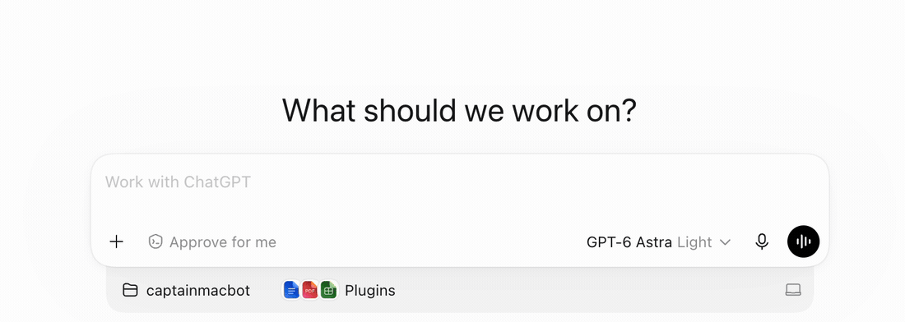

# Bosun

**ChatGPT의 마이크 버튼도 목소리로 누른다. 녹음 시작부터 메시지 전송까지 손을 쓰지 않고 제어하는 무료 Mac 앱.**



소리와 함께 보기: [한국어 시연](https://www.youtube.com/shorts/g9woBt5dl44) · [English demo](https://www.youtube.com/shorts/i1BzBHXi8xw)

“Record, please”로 녹음을 시작하고 메시지를 말한 뒤 “Send, please”로 전송한다. 소리가 없는 데모이며, 재생 속도를 높이고 대기 구간을 줄였다.

[Mac용 Bosun 다운로드](https://github.com/guileschool/Bosun/releases/latest) — Apple Silicon, macOS 14 이상. Developer ID 서명과 Apple 공증 완료.

매번 녹음·정지 버튼을 찾아 누르는 일을 줄이기 위해 만들었다. 소스에는 MIT 라이선스를 적용한다.

[설치·사용·문제 해결](USAGE.ko.md) · [English](../README.md)

## 현재 상태

현재 릴리스는 **0.8.13**이다. macOS 14 이상, Apple Silicon Mac과 기기 내 영어 음성 인식 자산이 필요하다. 메뉴는 한국어와 영어를 지원한다.

자동 검사는 통과했다. 배포용 DMG는 Apple 공증과 공증 티켓 첨부를 마쳤고 macOS Gatekeeper 검사도 통과했다. 전체 음성명령의 실제 동작과 다른 Mac에서의 새 설치는 아직 검증하지 않았다. [검증 상태](VALIDATION.md)를 참고한다.

## 업데이트

Bosun 메뉴에서 **업데이트 확인…**을 선택하면 새 버전을 다운로드하고 설치할 수 있다. 설정의 **업데이트 자동 확인**을 켜면 새 버전 알림을 받는다. 설치는 사용자가 승인한 뒤 진행하며 Bosun이 다시 실행된다.

**0.8.12 이하를 사용한다면** 이번 한 번은 Bosun을 종료하고 최신 DMG의 앱으로 Applications 설치본을 교체한다. 앱 안에서 업데이트하는 기능은 0.8.13부터 제공한다.

## 명령어

| 발화 | 동작 |
|---|---|
| Record | 녹음 시작 |
| Stop | 녹음 정지, 전사 유지 |
| Cancel | 받아쓰기 취소 |
| Send | 녹음 정지, 말끝 명령어 정리 후 전송 |
| Break | 진행 중인 전송 절차 또는 응답 생성 중단 |
| Clear | 입력 전체 삭제 |
| Delete | 마지막 단어 삭제 |
| Undo | 입력이 그대로일 때 직전 Bosun Delete 또는 Clear를 한 번 복원 |
| Enter | 줄바꿈 |
| Space | 공백 입력 |
| Home | 입력 맨 앞으로 이동 |
| End | 입력 맨 뒤로 이동 |

영어 받아쓰기에는 복합어 모드에서 `record please`, `stop please`, `send please`처럼 말한다. 표의 모든 명령어 뒤에 `please`를 붙여 사용한다. 메뉴 언어와 명령어 모드는 별도 설정이다.

## 빌드와 설치

Xcode Command Line Tools를 설치한 뒤 프로젝트 폴더에서 실행한다.

```sh
SIGN_IDENTITY=- zsh build.sh
zsh scripts/test.sh
```

`build/Bosun.app`에 로컬 시험용 앱이 만들어진다. 자동 설치나 실행은 하지 않는다. 기존 Developer ID 서명 앱을 업데이트할 때는 동일한 개발자 서명을 사용한다. 로컬 시험용 서명 앱으로 설치본을 덮어쓰지 않는다.

배포용 앱은 Applications로 옮겨 실행하고 마이크·음성 인식·손쉬운 사용 권한을 허용한다. 메뉴 막대에서 음성 감지를 시작한다.

[영문 안내](../README.md), [구조](architecture.ko.md), [배포 절차](RELEASING.md), [설치 안내](INSTALL.txt)를 참고한다. [MIT 라이선스](../LICENSE)를 적용한다. 저작권자는 JCUTPLUSSOFT다.

## 만든 사람

[guileschool](https://github.com/guileschool) · [캡틴맥봇](https://www.youtube.com/@captainmacbot)
